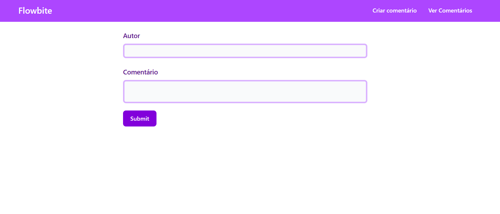
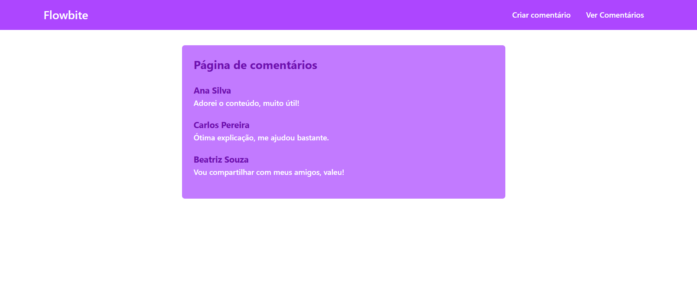
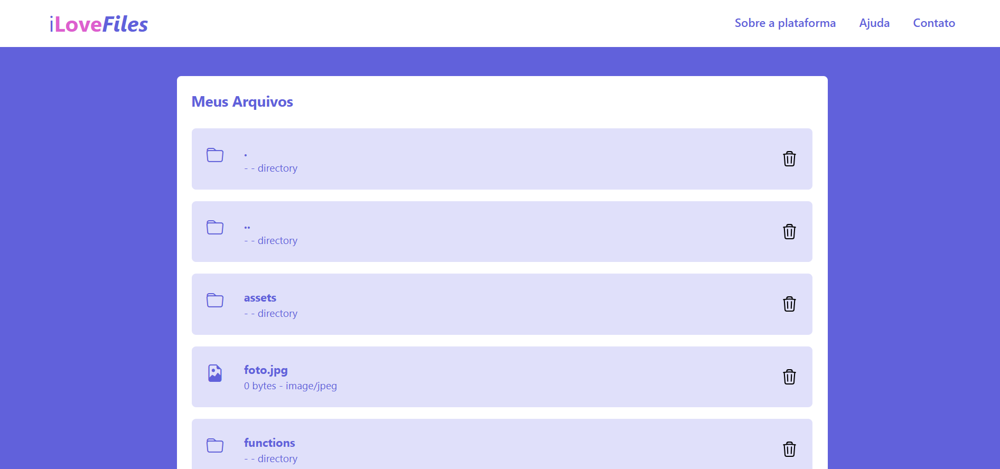

# 🐘 Estudos em PHP

Este repositório reúne meus estudos e experimentos com PHP puro. Aqui estão pequenos projetos desenvolvidos para treinar lógica, manipulação de arquivos e interação com o usuário.

---

## 📂 Projetos

### 📝 Comentários
Um sistema simples onde o usuário pode enviar um comentário e vê-lo exibido na tela. Os comentários são armazenados em arquivos, sem necessidade de banco de dados.

**Funcionalidades:**
- Envio de comentários via formulário
- Exibição dos comentários enviados
- Armazenamento em arquivo `.json`

### 💜 iLoveFiles
Aplicação que lista dinamicamente os arquivos e pastas contidos no diretório atual. Cada item exibe nome, tamanho e tipo do arquivo com um ícone correspondente.

**Funcionalidades:**
- Listagem de arquivos e diretórios
- Ícones personalizados por tipo de arquivo (ex: imagem, texto, PDF)
- Leitura automatizada do conteúdo da pasta

---

## 🚀 Tecnologias utilizadas

- PHP 8+
- HTML5
- CSS (TailwindCSS)
- Bootstrap Icons

---

## 📌 Objetivo

Este repositório tem fins educacionais e serve como base para meu aprendizado em desenvolvimento back-end com PHP puro. Mais projetos e melhorias serão adicionados ao longo do tempo.

---

