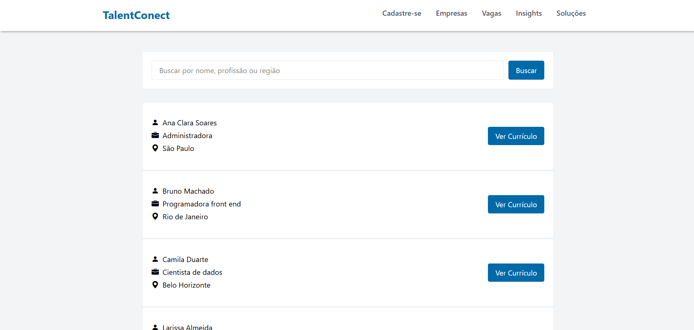
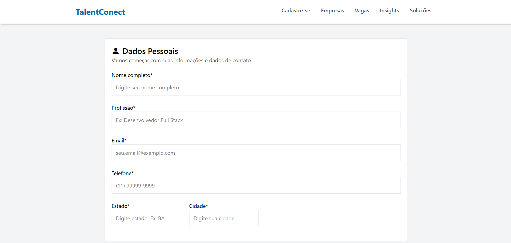
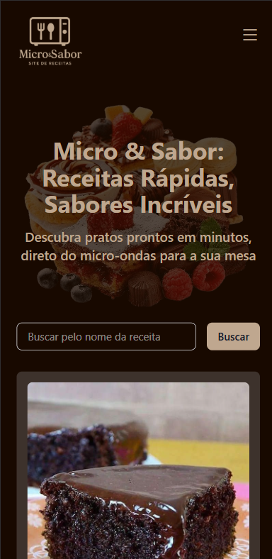
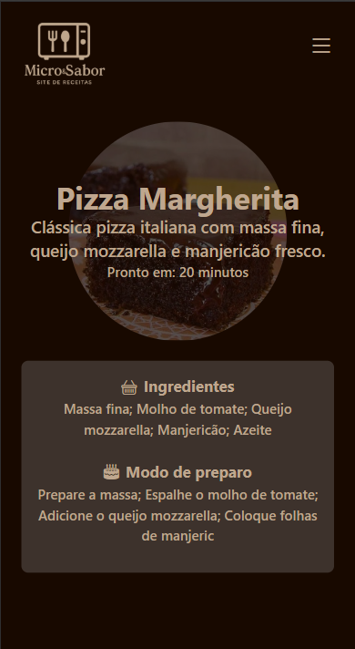
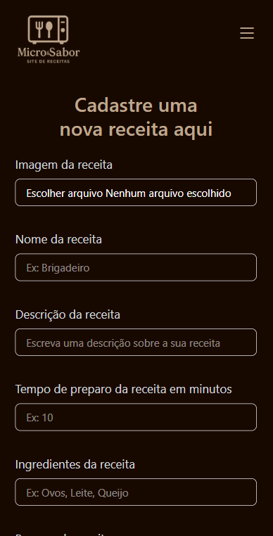
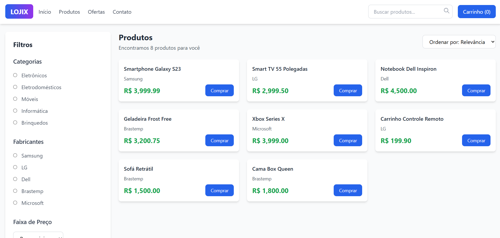

# 🐘 Estudos em PHP

Este repositório reúne meus estudos e experimentos com PHP puro. Aqui estão pequenos projetos desenvolvidos para treinar lógica, manipulação de arquivos, interação com o usuário e integração com banco de dados.

---

## 📂 Projetos

### 📝 Comentários
Um sistema simples onde o usuário pode enviar um comentário e vê-lo exibido na tela. Os comentários são armazenados em arquivos, sem necessidade de banco de dados.

**Funcionalidades:**
- Envio de comentários via formulário  
- Exibição dos comentários enviados  
- Armazenamento em arquivo `.json`

  

---

### 💜 iLoveFiles
Aplicação que lista dinamicamente os arquivos e pastas contidos no diretório atual. Cada item exibe nome, tamanho e tipo do arquivo com um ícone correspondente.

**Funcionalidades:**
- Listagem de arquivos e diretórios  
- Ícones personalizados por tipo de arquivo (ex: imagem, texto, PDF)  
- Leitura automatizada do conteúdo da pasta

---

### 🧠 Talent Conect
Projeto localizado na pasta `curriculos`, com integração ao banco de dados para gerenciamento de currículos.

**Funcionalidades:**
- Tela principal com listagem de pessoas cadastradas
  

--- 
- Visualização individual de currículos

---
- Cadastro de novos currículos via formulário

---

### 🍰 Micro&Sabor  
Projeto que permite a listagem, visualização detalhada e cadastro de receitas culinárias. Ideal para organizar e compartilhar receitas de forma simples e prática.

**Funcionalidades:**  
- Listagem das receitas cadastradas
  
  

- Visualização detalhada de cada receita (ingredientes, modo de preparo, descrição, etc.)
  

- Cadastro de novas receitas com upload de imagem ilustrativa  

  

---

### 🛍️ Lojix 
Projeto que permite a listagem, e busca filtrada de items de uma loja ficticia.
 
- Página principal
  
  

## 🚀 Tecnologias utilizadas

- PHP 8+  
- HTML5  
- CSS (TailwindCSS)  
- Bootstrap Icons  
- MySQL

---

## 📌 Objetivo

Este repositório tem fins educacionais e serve como base para meu aprendizado em desenvolvimento back-end com PHP puro. Mais projetos e melhorias serão adicionados ao longo do tempo.

---
